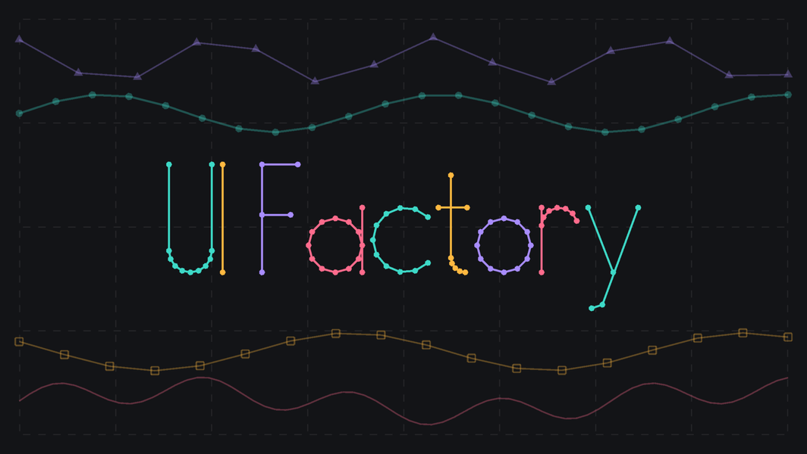

[](https://github.com/sxm-sxpxxl/ui-factory?tab=readme-ov-file#install)
[](https://unity.com/releases/editor/archive)
[](https://github.com/sxm-sxpxxl/ui-factory/blob/master/LICENSE.md)

<p align="left">
  
</p>

## About

UI Factory builds meshes for custom UI Toolkit controls.

You describe a shape as a plain record: a line, a point marker, a series of points, a whole graph. Inside `generateVisualContent` you hand the record to the `MeshGenerationContext`, and the factory turns it into vertices and indices and writes them into the context.

The result stays in a handle. On the next repaint the mesh is rebuilt only when the description changed. Geometry is computed by Burst-compiled procedures.

## Components

- **Lines** — `SolidLineMeshDescription` and `DashLineMeshDescription` (dash width and gap), with thickness and color
- **Points** — `FilledPointMeshDescription` and `OutlinedPointMeshDescription`, each a circle, square or triangle (`PointShape`) of a given size
- **Series** — `LineSeriesMeshDescription` joins a list of positions into one polyline (optionally closed, with padding); `PointSeriesMeshDescription` puts a marker on every position, can skip indices and highlight a selection with a second marker
- **Graph** — `GraphMeshDescription` combines a line series with its point markers and selection in one description

## Caching

Descriptions are C# records, so two descriptions with the same values are equal. The builder behind a handle compares the description it receives with the previous one and reuses the cached mesh when they match.

Collections go in as a `Snapshot<T>` of a `VersionedList<T>` or `VersionedHashSet<T>`. The snapshot carries the collection's version, so a changed list counts as a changed description without comparing elements.

Set `ForceBuild` to skip the comparison when you already know the mesh must be rebuilt, for example when you keep one mutable description per element and change it in place.

## Usage

A control that draws a dashed divider across its content rectangle:

```csharp
using System;
using SxmTools.UIFactory;
using SxmTools.UIFactory.Components.Lines;
using UnityEngine;
using UnityEngine.UIElements;

public sealed class Divider : VisualElement, IDisposable
{
    private MeshHandle _handle;

    public Divider()
    {
        generateVisualContent += Draw;
        RegisterCallback<DetachFromPanelEvent>(_ => Dispose());
    }

    private void Draw(MeshGenerationContext context)
    {
        var y = contentRect.center.y;
        var line = new DashLineMeshDescription(
            DashWidth: 10f, DashGap: 6f, Thickness: 2, Color: Color.gray,
            StartPosition: new Vector2(contentRect.xMin, y), EndPosition: new Vector2(contentRect.xMax, y));

        _handle = context.BuildMesh(line, _handle);
    }

    public void Dispose()
    {
        _handle?.Dispose();
        _handle = null;
    }
}
```

`BuildMesh` returns the handle to keep for the next repaint; pass `null` the first time.

A handle owns native vertex and index buffers, so dispose it when the element leaves the panel, as above. `UIFactoryManager.ActiveBuilderCount` tells how many handles currently hold a builder. A number that grows while nothing is being added is a leaked handle.

## Install

Unity 2021.2 or newer (the descriptions are C# 9 records), tested on Unity 6. The only dependency, `com.unity.burst`, comes from the Unity registry.

### OpenUPM

The package is published on the [OpenUPM registry](https://openupm.com/packages/com.sxm-tools.ui-factory/). With [openupm-cli](https://github.com/openupm/openupm-cli):

```bash
openupm add com.sxm-tools.ui-factory
```

Or add the scoped registry and the dependency to `Packages/manifest.json` yourself:

```json
{
  "scopedRegistries": [
    {
      "name": "package.openupm.com",
      "url": "https://package.openupm.com",
      "scopes": ["com.sxm-tools.ui-factory"]
    }
  ],
  "dependencies": {
    "com.sxm-tools.ui-factory": "7.0.0"
  }
}
```

### Git URL

Add the repository to the `dependencies` section of `Packages/manifest.json`:

```json
"com.sxm-tools.ui-factory": "https://github.com/sxm-sxpxxl/ui-factory.git"
```

## License

MIT, see [LICENSE.md](LICENSE.md).
